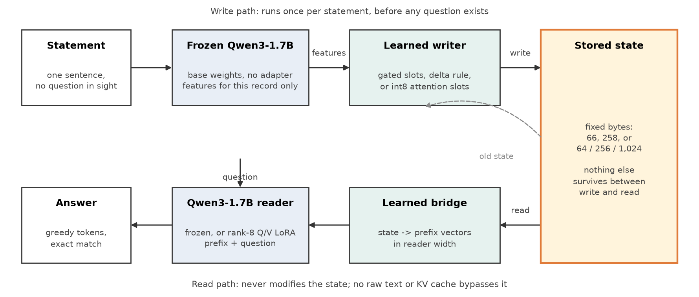
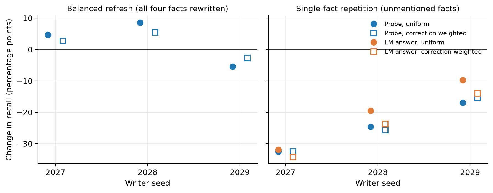
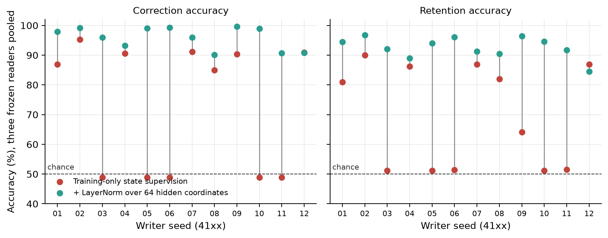
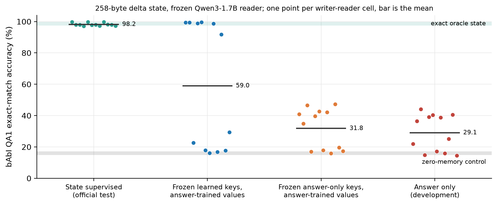
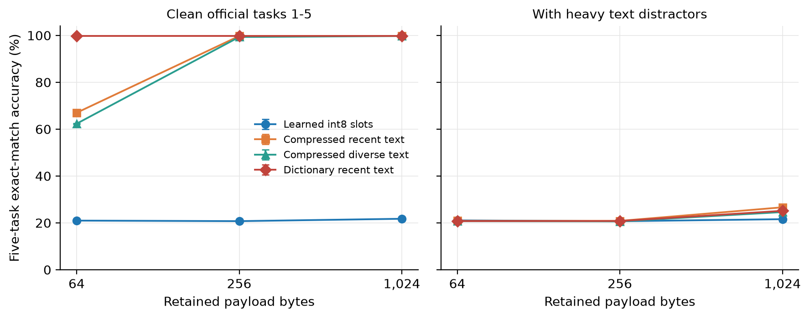

# TinyMem

Can a language model keep a small learned memory under a fixed byte budget, update it when facts change, and still recall the facts it was not told about?
TinyMem is the set of experiments I ran to find out, on a frozen Qwen3-1.7B reader with learned writers of 64 to 1,024 bytes.
The short answer is no, not with answer supervision alone, and the longer answer is more interesting than that.

Every study here was sealed before it ran: source, inputs, seeds, and schedules were hashed, and no accuracy threshold picked a checkpoint.
Negative results are reported next to the positive ones.

## What I found

1. **Learned writers had no storage advantage.**
   On a four-fact task that a parser stores in one byte, gated and delta writers at 66 and 258 bytes did not reach reliable recall.
   Repeating a fact the model already knew cost about 25 points of recall on the facts it did not mention.
2. **The read side works when the state is right.**
   With a parser writing the state, fresh bridges and rank-8 LoRA readers recalled 14,336 of 14,336 cases, and 97.9% to 99.5% on official bAbI QA1.
   Swap in another story's memory and the answers follow it, so the reader really does read the state.
3. **Learned writers fail by collapse, and LayerNorm fixes most of it.**
   Trained to reproduce correct states, two of three writers drove their write strength or hidden activations to zero.
   Affine-free LayerNorm over the 64 hidden coordinates raised correction from 72.9% to 95.9% and retention from 69.5% to 92.6% across 12 seeds, with the same parameters and bytes.
4. **State supervision reaches oracle accuracy on QA1; answer supervision does not.**
   State-supervised writers scored 98.2% on the official test against 98.3% with exact oracle memory.
   The same architecture trained only from answer tokens scored 14.5% to 44.1%, and the failure traced to writes interfering with each other.
5. **Addressing is the bottleneck.**
   Freezing the key branch from a state-supervised writer and training only the values from answers lifted recall from 31.8% to 59.0%, and retention across unrelated writes from 20.6% to 58.5%.
   Half the pairs still failed.
6. **At equal bytes, learned memory lost to every text store, and the reader ignored it.**
   Across bAbI tasks 1 to 5 at 64, 256, and 1,024 bytes, jointly trained int8 slot memory scored 21% in every cell, a few points above the zero-memory control.
   Compressed text hit 62% to 67% at 64 bytes and 99% at 256; a dictionary store hit 99.7% at 64.
   Under heavy distractors every method, text included, fell to 21% to 27%.

So the write side is the problem, not the read side.
Writers can learn correct states when the state is supervised, but end-to-end answer supervision under a byte budget never produced a memory the reader used.

## How it works



The writer never sees a question, an answer, or a gold write address.
The byte count is only what survives between writes and reads; shared weights and dictionaries are reported separately.

| Writer | Update rule | Bytes | Module |
|---|---|---|---|
| Gated slots | `next = old + sigmoid(gate) * (tanh(candidate) - old)` | 66 | [gated_slots.py](src/tinymem/memory/gated_slots.py) |
| Delta rule | `next = state + outer(key, beta * (value - key @ state))` | 66, 258 | [delta_slots.py](src/tinymem/memory/delta_slots.py) |
| Quantized attention slots | token cross-attention, slot self-attention, gated residual, int8 on every write | 64, 256, 1,024 | [quantized_slots.py](src/tinymem/memory/quantized_slots.py) |

## Results in more detail

### Repetition hurts (phase one)



Four independent binary facts, a 66-byte gated state, eight prefix writes, then eight more writes that either refresh all four facts or repeat one.
Refreshing everything moves recall by a few points either way.
Repeating one fact costs 10 to 34 points on the three facts that were not mentioned, in both the LM answer and a linear probe.
Numbers are in [phase1.csv](results/phase1.csv); the code is at tag `phase-one-archive`.

### Writer collapse and the LayerNorm patch



The 258-byte delta writer is trained to reproduce parser-written states and then read by three frozen readers.
Five of twelve control seeds sit at chance on both metrics because the writer collapsed.
LayerNorm over the hidden coordinates lifts every collapsed seed above 90% and helps most of the others; one seed loses 2.5 points.
Paired 95% intervals across seeds are +11.6 to +35.0 points for correction and +13.1 to +33.3 for retention.
Per-seed values: [writer_collapse.csv](results/writer_collapse.csv).

### What supervises the writer decides everything (QA1)



One architecture, four training recipes.
State supervision lands in the oracle band on the official test.
Answer-only training lands between 14% and 44%.
Freezing learned keys and training values from answers reaches 92% or better in six of twelve pairs and stays below 30% in the other six; freezing answer-only keys does not help.
Per-cell values: [qa1_readout.csv](results/qa1_readout.csv).

### Storage frontier



The closing study: nine learned cells (three budgets, three seeds) and three text-store cells, trained jointly from answer tokens on bAbI tasks 1 to 5 with WikiText-2 distractors, then scored on all 5,000 official test questions from the fixed final checkpoint.

| Method | 64 B | 256 B | 1,024 B |
|---|---:|---:|---:|
| Learned int8 slots | 21.0 | 20.7 | 21.7 |
| Compressed recent text | 67.0 | 99.7 | 99.7 |
| Compressed diverse text | 62.3 | 99.3 | 99.7 |
| Dictionary recent text | 99.7 | 99.7 | 99.7 |

Five-task exact-match accuracy in percent on clean test questions, mean of three seeds; ranges are in [storage_frontier.csv](results/storage_frontier.csv).
Zero-memory controls scored 17.2% and other-story controls 16.6%, and the learned cells' QA1 and QA2 accuracy was identical to three decimals across all nine cells: the reader learned the answer prior and nothing from the state.
On BABILong 1k transfer, learned memory stayed at 20%, while compressed text reached 34.5%, 50.1%, and 88.4%.
Two evaluation-only bugs were fixed as recorded protocol amendments that reuse the fitted seals; the report lists the chain.

## The studies

Each study has a runner that prepares a sealed bundle, fits every declared cell, seals, evaluates, and reports.
A stage refuses to run if any hashed input, source file, or runtime differs from the seal, and it refuses to overwrite a cell.

| Study | Question | Runner | Cells |
|---|---|---|---|
| Phase one | Does truthful repetition preserve unmentioned facts? | tag `phase-one-archive` | - |
| Delta comparison | Do residual updates with learned addresses retain better than gating? | [run_delta_study.py](scripts/run_delta_study.py) | 12 |
| Correct-state readout | Can the reader use a correct, query-independent state? | [run_oracle_study.py](scripts/run_oracle_study.py) | 3 |
| Learned writer | Can a writer learn correct states, and why does it collapse? | [run_distilled_study.py](scripts/run_distilled_study.py) | 3 or 12 |
| QA1 readout | Does the read side transfer to an official benchmark? | [run_qa1_study.py](scripts/run_qa1_study.py) | 3 |
| Storage frontier | At equal bytes, does learned memory match text stores? | [scripts/frontier/](scripts/frontier/) | 12 |

## Getting started

Python 3.11 or newer and [uv](https://docs.astral.sh/uv/).

```bash
uv sync --locked --python 3.11 --extra dev --extra research
uv run --no-sync python -m pytest            # 326 tests, CPU, about 90 s
uv run --no-sync python scripts/make_figures.py
```

The tests use tiny random readers and synthetic facts.
They check contracts and code paths, not model accuracy.

Nothing in `data/` beyond the manifest is tracked.
Two scripts fetch and checksum everything the studies read; the parsers in `src/tinymem/data/` and `src/tinymem/studies/*/data.py` do the rest.

```bash
uv run --no-sync python scripts/download_data.py    # bAbI en-10k, BABILong qa1-qa5, WikiText-2 raw
uv run --no-sync python scripts/download_model.py   # Qwen3-1.7B at the pinned revision, about 4 GB
```

## Running a study

Every runner has the same shape: `prepare` builds the bundle, `train --cell N` fits one cell, `seal`, `evaluate --cell N`, `report`.
Run from the repository root with `MODEL=data/raw/pretrained/qwen3-1.7b`, and pass `--help` to any runner for its stages.

```bash
S=scripts/run_delta_study.py
uv run --no-sync python $S prepare  --output artifacts/delta --snapshot $MODEL --device cuda
uv run --no-sync python $S train    --study artifacts/delta --snapshot $MODEL --cell 0    # 0..11
uv run --no-sync python $S seal     --study artifacts/delta
uv run --no-sync python $S reference --study artifacts/delta --snapshot $MODEL
uv run --no-sync python $S evaluate --study artifacts/delta --snapshot $MODEL --cell 0
uv run --no-sync python $S report   --study artifacts/delta
```

Differences between runners:

- `run_oracle_study.py` has no `reference` stage.
- `run_distilled_study.py` needs `--parent artifacts/oracle`, adds a `features` stage before training, fits writers on CPU, and takes `--fixed-beta 0.75`, `--normalize-hidden`, and `--replicate` to select the two patches and the 12-seed panel.
- `run_qa1_study.py prepare` takes `--training-file data/raw/tasks_1-20_v1-2/en-10k/qa1_single-supporting-fact_train.txt` and has no `seal`.
- The frontier study is a directory of scripts that get copied into the bundle and hashed with it:

  ```bash
  uv run --no-sync python scripts/frontier/prepare.py prepare --study artifacts/frontier
  uv run --no-sync python scripts/frontier/prepare.py freeze  --study artifacts/frontier
  cd artifacts/frontier && export PYTHONPATH=$PWD/source/src
  python run.py features  --study . --model ../../$MODEL
  python run.py preflight --study . --model ../../$MODEL
  python run.py train     --study . --model ../../$MODEL --cell 0    # 0..11, then evaluate and transfer
  python report.py --study .
  ```

Add `--smoke` to a `prepare` (delta, oracle, distilled) for a one-cell bundle that runs the whole path in minutes.
Full cells ran on one 40 GB Ampere GPU in BF16; the runtime is recorded in each seal and a cell will not score under a different one.

### Slurm

[scripts/slurm/gpu.slurm](scripts/slurm/gpu.slurm) and [cpu.slurm](scripts/slurm/cpu.slurm) wrap any runner stage in one job and pass the array index as `--cell`.
They carry no site names; add `--partition`, `--account`, or `--constraint` on the `sbatch` line, and set `TINYMEM_ENV` if your Python environment is not the repository `.venv`.

```bash
sbatch scripts/slurm/gpu.slurm scripts/run_delta_study.py prepare --output artifacts/delta --snapshot $MODEL --device cuda
sbatch --array=0-11 scripts/slurm/gpu.slurm scripts/run_delta_study.py train --study artifacts/delta --snapshot $MODEL
sbatch --array=0-11 scripts/slurm/cpu.slurm scripts/run_distilled_study.py train --study artifacts/distilled
```

The frontier bundle gets its own [gpu.slurm](scripts/frontier/gpu.slurm) and [cpu.slurm](scripts/frontier/cpu.slurm); submit them from inside the bundle with `TINYMEM_ENV` and `TINYMEM_MODEL` set.

## Layout

| Path | What is in it |
|---|---|
| `src/tinymem/memory/` | The state contract and the three writers |
| `src/tinymem/reader/` | Qwen loader and verifier, prefix reader, LoRA, prompt, exact-match scoring |
| `src/tinymem/data/` | bAbI and WikiText parsers, reader case contract |
| `src/tinymem/studies/` | One package per study: data, protocol, fitting, scoring, report |
| `scripts/` | Runners, downloaders, `make_figures.py`, `profile_training.py`, Slurm templates |
| `tests/` | Contract and end-to-end tests on tiny models |
| `results/` | CSV tables extracted from the sealed bundles, and the figures drawn from them |

The checkout holds only the code the studies above execute.
The from-scratch decoder and the phase-one lineage live at tag `phase-one-archive`.
Sealed bundles carry their own copy of the source tree, so they verify against that copy, not this checkout.

## Scope

The code reruns every study from public data and the pinned model.
Exact numbers depend on the recorded runtime (locked package versions, BF16 CUDA on Ampere, deterministic algorithms, TF32 off), so a rerun elsewhere is a replication rather than a verification of the sealed bundles, and the seals will say so.
Dataset licenses and model terms apply separately.
